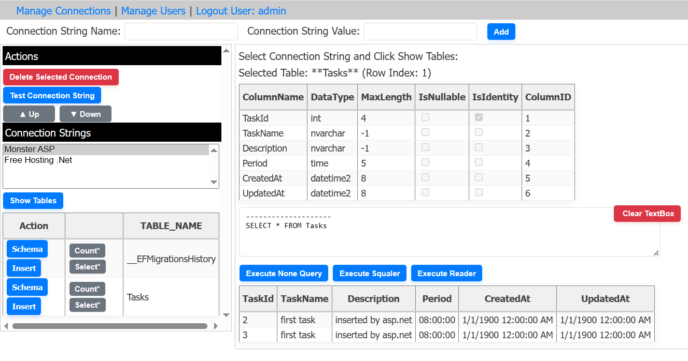

# Database Connection Manager

A comprehensive web-based application for managing database connections across multiple database types with user authentication and secure storage.

## Description

This ASP.NET Web Forms application provides a complete database management interface supporting SQL Server, PostgreSQL, and MySQL databases. Users can securely store, manage, and test their database connections, execute queries, and explore database schemas - all with proper user isolation and authentication.



## Features

### 🔐 Authentication & Security
- User login and session management
- User-specific data isolation
- Secure SQLite database storage
- No sensitive data in version control

### 🗄️ Multi-Database Support
- **SQL Server** - Full T-SQL support with table exploration
- **PostgreSQL** - Complete PostgreSQL query execution
- **MySQL** - MySQL database operations and schema browsing

### 📊 Connection Management
- CRUD operations for connection strings (Create, Read, Update, Delete)
- Connection testing and validation
- Database schema exploration (tables, columns)
- Query execution with result display
- Automatic INSERT statement generation

### 👥 User Management
- Admin user management interface
- User creation and deletion
- Secure password storage

## Technologies Used

- **ASP.NET Web Forms** - Web application framework
- **C#** - Programming language
- **SQLite** - Local data storage for users and connections
- **Entity Framework** - ORM for data operations
- **System.Data.SqlClient** - SQL Server connectivity
- **Npgsql** - PostgreSQL connectivity
- **MySql.Data** - MySQL connectivity
- **CSS** - Styling and responsive design
- **Microsoft .NET Framework 4.8** - Runtime environment
- **Visual Studio** - Development environment

## Prerequisites

- .NET Framework 4.8
- IIS or Visual Studio Development Server
- Modern web browser (Chrome, Firefox, Edge, Safari)
- Database servers (optional, for testing connections):
  - SQL Server
  - PostgreSQL
  - MySQL

## Installation and Setup

### 1. Clone the Repository
```bash
git clone https://github.com/mohamadsaleh/Manage-Connection-Strings.git
cd Manage-Connection-Strings
```

### 2. Open in Visual Studio
- Open `WebsiteConnectionStrings.sln` in Visual Studio
- The solution will automatically restore NuGet packages

### 3. Database Setup
The application uses SQLite for local storage. The database is created automatically on first run with:
- Default admin user: `admin` / `admin`
- Empty connection strings table

### 4. Build and Run
- Press F5 or click "Start Debugging"
- The application opens in your default browser
- Login with username: `admin`, password: `admin`

## Application Structure

### Pages
- **Login.aspx** - User authentication
- **ConnectionStrings.aspx** - Manage user's database connections
- **Users.aspx** - Admin user management
- **SqlServer.aspx** - SQL Server database operations
- **PostgreSql.aspx** - PostgreSQL database operations
- **Mysql.aspx** - MySQL database operations

### Key Components
- `App_Code/SqliteHelper.cs` - SQLite database operations
- `App_Code/DatabaseHelper.cs` - SQL Server helper methods
- `App_Code/PostgreSqlDbHelper.cs` - PostgreSQL helper methods
- `App_Code/MysqlDbHelper.cs` - MySQL helper methods
- `App_Data/ConnectionStrings.db` - SQLite database (auto-created, gitignored)

## Usage Guide

### First Time Setup
1. Run the application
2. Login with default credentials: `admin` / `admin`
3. The SQLite database is created automatically

### Managing Connection Strings
1. Navigate to "Connection Strings" page
2. Add new connections with appropriate database types
3. Test connections before saving
4. Edit or delete existing connections

### Database Operations
1. Select a database type from the navigation menu
2. Choose a connection string from your saved connections
3. Test the connection
4. Execute queries or explore database schema
5. View results in grid format

### User Management
1. Access "Users" page (admin only)
2. Add new users or delete existing ones
3. Each user has isolated connection strings

## Database Schema

The SQLite database contains:
- **User** table: UserId, UserName, Password
- **ConnectionString** table: ConnectionStringId, UserId, ConnectionStringName, ConnectionStringValue, Type

## Security Features

- **Database files excluded** from version control (.gitignore)
- **User isolation** - users only see their own connections
- **Session-based authentication**
- **Parameterized queries** to prevent SQL injection
- **No hardcoded credentials** in source code

## Project Structure

```
WebsiteConnectionStrings/
├── App_Code/
│   ├── config/
│   │   ├── SqliteHelper.cs      # SQLite database operations
│   │   ├── User.cs              # User model
│   │   └── ConnectionString.cs  # Connection string model
│   ├── DatabaseHelper.cs        # SQL Server helpers
│   ├── PostgreSqlDbHelper.cs    # PostgreSQL helpers
│   └── MysqlDbHelper.cs         # MySQL helpers
├── App_Data/
│   └── ConnectionStrings.db     # SQLite database (gitignored)
├── Bin/                         # Compiled assemblies
├── *.aspx                       # Web forms
├── *.aspx.cs                    # Code-behind files
├── main.master                  # Master page
├── style.css                    # Stylesheet
├── Web.config                   # Application config
├── .gitignore                   # Git ignore rules
└── README.md                    # This file
```

## API Reference

### SqliteHelper Methods
- `GetUsers()` - Get all users
- `GetUserByUserName(string)` - Get user by username
- `SaveUser(User)` - Create/update user
- `DeleteUser(string)` - Delete user by username
- `GetConnectionStrings()` - Get all connection strings
- `GetConnectionStringsByUserId(int)` - Get user's connections
- `SaveConnectionString(ConnectionString)` - Create/update connection
- `DeleteConnectionString(int)` - Delete connection by ID

## Troubleshooting

### Database Connection Issues
- Ensure target database servers are running
- Verify connection strings are correct
- Check firewall settings for database ports

### Compilation Errors
- Restore NuGet packages in Visual Studio
- Ensure .NET Framework 4.8 is installed
- Clean and rebuild the solution

### SQLite Issues
- Delete `App_Data/ConnectionStrings.db` to reset database
- The application will recreate it automatically

## Contributing

1. Fork the repository
2. Create a feature branch (`git checkout -b feature/new-feature`)
3. Make your changes
4. Test thoroughly
5. Commit your changes (`git commit -am 'Add new feature'`)
6. Push to the branch (`git push origin feature/new-feature`)
7. Create a Pull Request

## License

This project is for educational and demonstration purposes. Use in production environments requires proper security review and testing.

## Support

For issues or questions:
- Check the troubleshooting section
- Review the code comments
- Test with the default admin account

---

**Version:** 2.0
**Last Updated:** December 2025
**Framework:** .NET Framework 4.8
**Database:** SQLite (local), supports SQL Server/PostgreSQL/MySQL (remote)